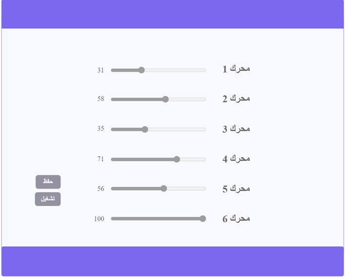

# Arm Controller Interface
This interface is designed to control the robot arm.
# Usage
after running the program, this web page must appear.

the function of this interface is to move the range slider for the porpuse of moving the robot arm with a specific value.
